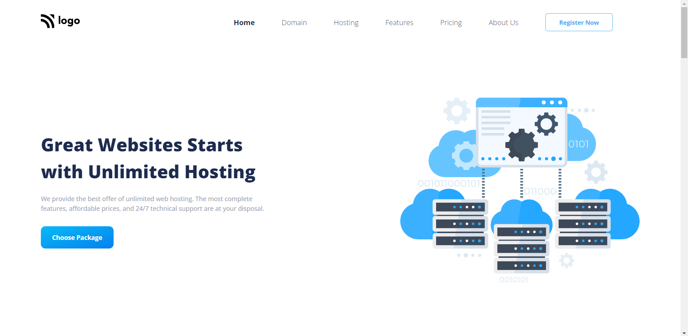

# Hosting Landing Page

> Project 11

<table>
<tr>
<td>
  A landing page designed using pure HTML & CSS.
</td>
</tr>
</table>

### Skills Gained from this

- Navbar using CSS flexbox.
- Elements positioning using CSS grid, flexbox property.
- Wrote HTML code from scratch for this page.
- Class, tag selector for HTML elements.
- Created cards for displaying contents in better formats.
- Media queries to make responsive in all devices.

### Screenshot

## Device support

This webpage is compatible with desktop/tablet/mobile screens, and consistent improvements are being made.

## Author

### Bug / Feature Request

If you find a bug or to request a new feature, kindly open an issue [here](https://github.com/Shashanka8/Project-11-Hosting-Landing-Page/issues/new).
